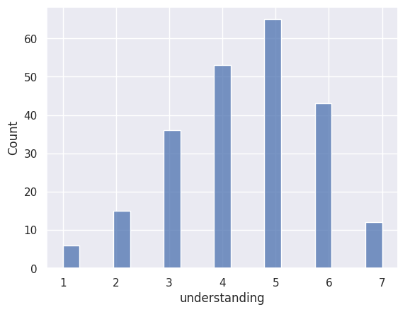
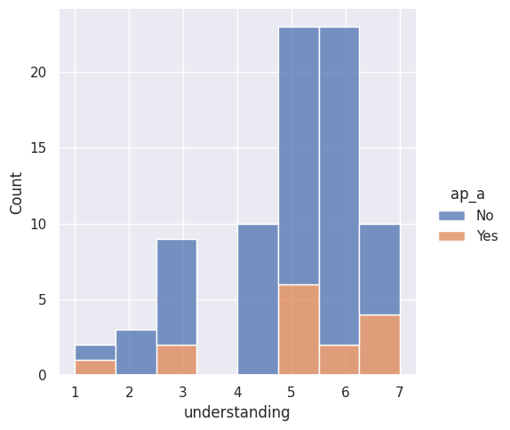

---
# Do not edit the text between these lines!
layout: default
---

# My Analysis: AP Computer Science and COMP110 Preparedness

## Summary
I believe that COMP110 would be a more effective course if it could target first-time coders more directly. Thus, I saught to explore the relationship between weather or not students had taken AP Computer Science, how difficult they considered the ocurse to be, and how confident they felt in their understanding. I hypothesized that students who had taken AP Computer Science would report lower difficulty and higher understanding, which would offer support for the claim that AP Computer Science should fulfill credit for this course, removing students with coding experience and increasing the percentage of first-time coders enrolled. 

## Visuals
<!-- This is a comment. Below, you'll see code for inserting an image. To make this image appear, update <custom-path>. To add an image, save it inside the imgs folder of this repository. -->

## Conclusion
After reviewing my models, I was not able to conclude weather or not AP Computer Science completion was related to higher levels of understanding and lower reported difficulty. The median difficulty rating from those who took AP Computer Science was the same as those that did not, and levels of understanding between the class with a higher proportion of students who had taken AP Computer Science (Alyssa's class) had relatively similar levels of reported understanding as Izzi's class. In order to continue exploring my hypothesis, we might consider observing data from several years, so that we can see if there are any longer-term trends between AP completion and preparedness in COMP110. However, the costs of this experimentation are notable, as it would require the AP curriculum and the COMP110 curriculum to remain unchanged for the next several years. If the curriculum changes, the trends observed may be less descriptive of overall preparedness for the next incoming class. However, keeping the curriculum unchanged negatively impacts students, as there are consistently updates to programming languages themselves, so lessons may become antiquated or even useless if unchanged for several years.
  