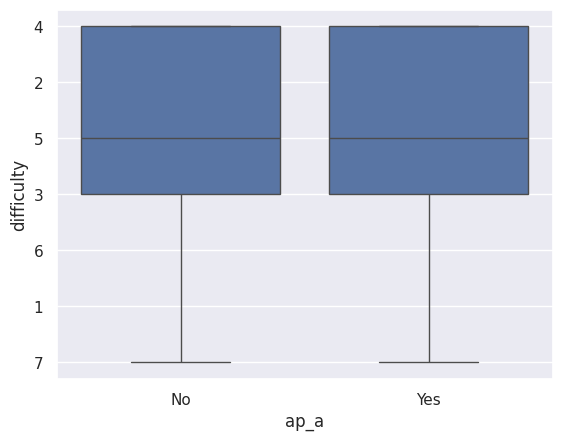
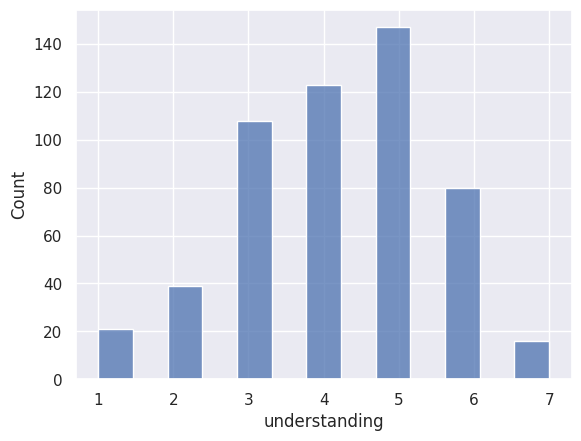
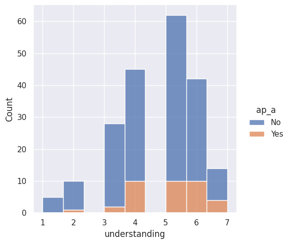

---
# Do not edit the text between these lines!
layout: default
---

# My Analysis: AP Computer Science and COMP110 Preparedness

## Summary
I believe that COMP110 would be a more effective course if it could target first-time coders more directly. Thus, I saught to explore the relationship between weather or not students had taken AP Computer Science, how difficult they considered the ocurse to be, and how confident they felt in their understanding. I hypothesized that students who had taken AP Computer Science would report lower difficulty and higher understanding, which would offer support for the claim that AP Computer Science should fulfill credit for this course, removing students with coding experience and increasing the percentage of first-time coders enrolled. 

## Visuals
<!-- This is a comment. Below, you'll see code for inserting an image. To make this image appear, update <custom-path>. To add an image, save it inside the imgs folder of this repository. -->

## Conclusion
After reviewing my models, I was not able to conclude weather or not AP Computer Science completion was related to higher levels of understanding and lower reported difficulty.  